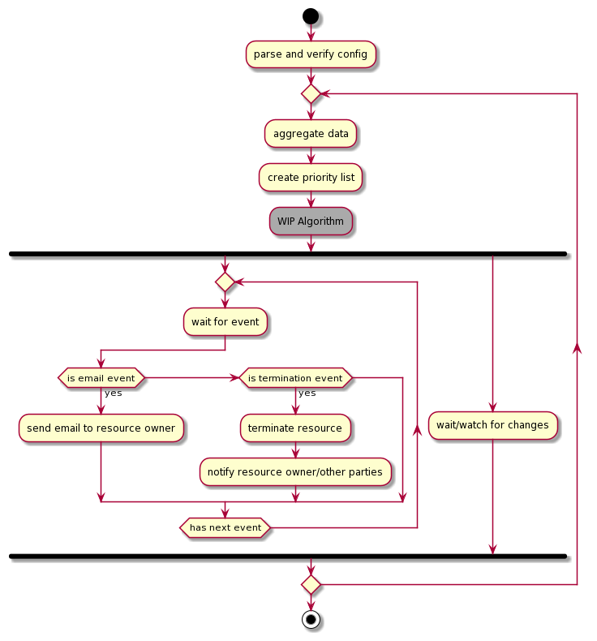
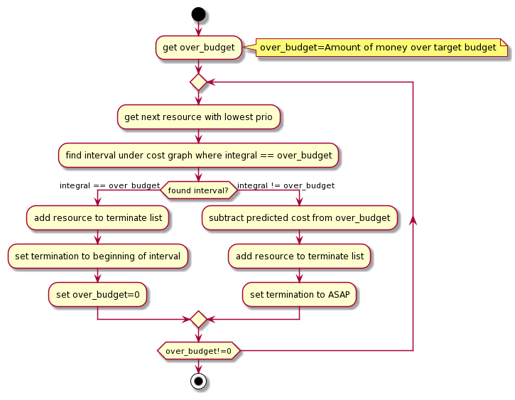

# Open Telekom Cloud Cost Control (OT3C)

OT3C is a tool for automatic control of cloud resources based on cost and budgeting.

Using the OTC Enterprise Dashboard and the OTC APIs, OT3C analyzes cloud resources based on cost to determine if a specific budget is going to be exceeded. If the predicted cost are exceeding the budget, the tool is able to:

- create a priority list of resources that are more important than others
- alert the owners of resources regarding lower priorities and exceeding budgets (WIP)
- terminate resources with lower priorities to stay under the budget

## Resources that can be controlled

- ECS
- EVS

TODO:
- NodePools
- CCE
- database
- ...

## How to use it

To use OT3C, you need:

1. a valid configuration
2. cloud resources in your infrastructure with an ot3c_prio tag set

First, create a config file based on the options described in the section below and place it next to the OT3C binary.

Next, go into your OTC console and go to any supported resource. Create add a "ot3c_prio" tag with any numeric value on this resource.

After this is done you can use the commands described below to manage your resources.

OT3C has two types of commands:

- short lived commands
- long lived commands

### Short lived Commands

Short lived commands are commands that perform one function of OT3C and terminate after that.

They have been initial created for debugging and development but can still be useful during production.

- **verify** (perform a preflight check and test the config)
- **list** (list all resources that are manageable by OT3C)
- **plan** (predict future cost of all resources and create a Termination Plan)

### Long lived Commands
These are the commands that can run in the background and need to be terminated by hand in order to stop. (CTRL-C will do)

They are primarily the commands that can terminate resources based on a Termination Plan.

- **exec** (long-running daemon that executes an exported Termination Plan file)
- **run** (daemon that predicts, plans and terminates resources automatically) (WIP) 


## How does it work

OT3C retrieves information from Enterprise Dashboard APIs regarding Resources, Services and their cost, and maps them to the OTC API resource equivalent.

Using different cost prediction models, OT3C creates a cost forecast for the end of the month. 
In case a specified target budget is predicted to be exceeded, OT3C notifies the resource owners with resources of lower priority about the cost issue and encourages them to shut down those resources.

If no action is taken, OT3C will terminate the resources via the OTC APIs and notify the owners about the termination.

OT3C can run as a daemon in the background on any machine/container/cloud of your choice, and periodically checks for updates regarding infrastructure and services. When it detects changes, it restarts the cycle.



### Cost prediction
(WIP) 
- At the moment it is just a steady state analysis for development but will receive an update when more information is available.


### Termination decision algorithm



The basic thought behind the termination is that a specific amount of money has to be saved until the end of the cost month.

OT3C will iterate through a priority list and will try to find a period in which the cost if a single resource equals the amount of money that needs to be saved.

If it cannot find a period, it will add this resource to the "to terminate" list, subtract the amount of money saved by this termination from the amount of money has to be saved, and move to the next resource with higher priority.

This loop will stop, if the priority of the resource currently processed is 0. If there is still some money left, the algorithm will return with the current termination list and with an error "End of manageable Resource list".


## Concepts

Here you can find some details about the inner workings of OT3C, like:

- Virtual Resources

### Virtual Resources

Virtual Resources are the virtual representation of Cloud Resources or grouping of multiple resources. OT3C creates them by combining information from the OTC APIs and the Enterprise Dashboard. 
There are different VR implementations for different Cloud Resources. 
Each have to implement the *VirtualResource* interface.
``` go
type VirtualResource interface {
	GetID() string
	GetDescription() string
	GetCostItems() []CostItem
	GetPredCostItems() []CostItem
	GetTags() map[string]string
	Terminate(*golangsdk.ProviderClient) error
}
```
Currently available implementations are:

- ECSResource
- EVSResource
- GroupResource
- GhostResource

OT3C uses VRs to predict the budget and manage the resources in case they need to be terminated.

#### ECSResource
ECSResource is a representation of an ECS Instance.
Resource IDs will start with `ECS_` followed by the ID of the instance.

#### EVSResource
EVSResource is a representation of an EVS Volume.
Resource IDs will start with `EVS_` followed by the ID of the volume.

#### GroupResource

GroupResource is a resource that is combining multiple other VRs to a single VR.
With this, multiple VRs are managed together and can be terminated at the same time.

This might be useful if you have multiple VRs that have a technical dependency and might not work correctly if one of the resources are terminated while the other one is still running.
Resource IDs will start with GR_ followed by a list of IDs of all the VRs grouped together.


#### GhostResource

A GhostResource is a representation of a Resource that must have existed and has created costs for the current budget calculation. This might can be a ECS instance that has be terminated but still is important for cost prediction.
Resource IDs will start with GH_ followed by the Product ID and the past ID of that resource.

## Config

There are two ways of configuring OT3C:

- via a config file
- via OTC Tags


### Config file
The config file is the primary way of configuring OT3C.
Here you can set credentials, budgets, tag options, contact emails .... 

Name: *ot3c.yaml*
Location: folder of execution or home dir.


#### Enterprise Dashboard Creds
OT3C requires access to the Enterprise Dashboard APIs for monitoring costs and budgets.
In the Enterprise Dashboard, an admin can create API tokens that are valid for 90 days.
The token needs a security level of **ADMIN**.

````
dashboard-secret: <very long api token>
````


#### OTC Creds
OT3C accesses the OTC with AK/SK authentication.
The following values need to be provided:

````
otccreds
  identityendpoint: https://iam.eu-de.otc.t-systems.com/v3
  projectid: "<project_id to monitor>"
  projectname: "<project_name to monitor>"
  accesskey: "<accesskey>"
  secretkey: "<secretkey>"
````


#### Target Budget
OT3C needs a Target budget that it will use as a budget that is not to be exceeded.
Value is the Target Budget in €.
````
target-budget: 48.0
````

#### Billing begin (optional)
OT3C can be used to set a custom start of the billing month.

````
billing-begin: 2020-01-01
````

#### ASAP Termination Grace
OT3C can give the resources which are to be terminated ASAP a small grace period so that data can still be saved, if necessary.
````
termination-grace: 24h0m0s
````


### Config file options planned

- maintainer email list


### Tags
Many resources on the OTC are taggable and can have extra metadata. This metadata can then be used by OT3C to determine properties like priority, grouping, resource owner, etc.


**Implemented Tags:**
- `ot3c_prio`
- `ot3c_group`

#### ot3c_prio

"ot3c_prio" is an integer value between 0 and 2147483647 that represents the priority of any given resource.

The **lower the value** the **higher the priority**. For example, let A be a resource with the Tag `ot3c_prio=5`, and B a resource with the Tag `ot3c_prio=1`. In case of an exceeded budget, Resource A will be terminated before Resource B.
A resource with the Tag **ot3c_prio*=0 will never be terminated**, no matter the cause.


#### ot3c_group

`ot3c_group` allows the grouping of resources that have the same technical dependency. This way these resources will be managed together and dependency between resources will be satisfied. 

`ot3c_group` values should be a string. Any Resource with the same value will be grouped together. 


### Tags planned for future implementation:

- `ot3c_owner` -> the owner's email address
- `ot3c_instance` -> desigante specific ot3c instance to be managed by OT3C.
